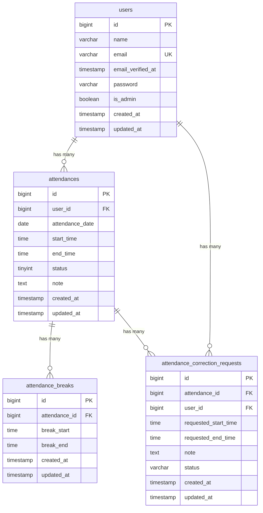

# 勤怠管理アプリ

Laravelを使用した勤怠管理システムです。
一般ユーザーは、出勤・休憩・退勤の打刻、勤怠一覧・詳細の確認、勤怠修正申請、マイ勤怠レポートの確認を行うことができます。
管理者は、一般ユーザーの勤怠確認・修正、修正申請の確認・承認、スタッフ別勤怠の確認、CSV出力などを行うことができます。
また、勤怠情報を取得・登録・更新・削除するAPIを実装しています。

## 作成者

安藤龍一

## 使用技術

- PHP8.2
- Laravel 10.x
- MySQL 8.0
- Nginx
- Docker / Docker Compose / Laravel Sail
- Vite
- Blade
- Laravel Sanctum
- PHPUnit

## ER図



## 開発環境URL

http://localhost

## 動作環境

- Docker
- Docker Compose
- Laravel Sail
  ※Windowsの場合はWSL2の利用を推奨します。

## 環境構築手順

1. **リポジトリをクローン**

```bash
git clone https://github.com/ryuichi-ando/attendance-app.git
```

2. **.envファイルの準備**

`.env.example` をコピーして `.env` を作成します。

```bash
cp .env.example .env
```

.envのDB接続情報を確認します。

```ini
DB_CONNECTION=mysql
DB_HOST=mysql
DB_PORT=3306
DB_DATABASE=laravel
DB_USERNAME=sail
DB_PASSWORD=password
```

3. **Composer依存パッケージのインストール**

プロジェクトの初回セットアップ時は、`vendor` ディレクトリが存在しないため `sail` コマンドを使用できません。
以下のDockerコマンドを実行して、コンテナ内で `composer install` を実行します。

```bash
docker run --rm \
    -u "$(id -u):$(id -g)" \
    -v "$(pwd):/var/www/html" \
    -w /var/www/html \
    laravelsail/php82-composer:latest \
    composer install --ignore-platform-reqs
```

4. **Laravel Sailの起動**

以下のコマンドでDockerコンテナを起動します。

```bash
./vendor/bin/sail up -d
```

> **エイリアスの設定（推奨）**
>
> 毎回 `./vendor/bin/sail` と入力するのは手間なので、エイリアスを設定すると便利です。
>
> ```bash
> alias sail='[ -f sail ] && bash sail || bash vendor/bin/sail'
> ```

5. **アプリケーションキーの生成**

```bash
sail artisan key:generate
```

6. **データベースのマイグレーションと初期データ投入**

以下のコマンドでテーブルを作成し、ダミーデータを投入します。

```bash
sail artisan migrate:fresh --seed
```

7. **フロントエンドのビルド**

```bash
sail npm install
sail npm install alpinejs
sail npm run dev
```

※`npm run dev` は開発中は起動したままにしてください。

8. **アプリケーションへのアクセス**

ブラウザで [http://localhost](http://localhost) にアクセスします。

## テスト実行

```bash
sail artisan test
```

カバレッジ付きで実行する場合:

```bash
sail artisan test --coverage
```

## 機能一覧

1. 一般ユーザー

- ユーザー登録
- ログイン・ログアウト
- メールアドレス認証
- 出勤打刻
- 休憩開始
- 休憩終了
- 退勤打刻
- 勤怠一覧表示
- 勤怠詳細表示
- 勤怠情報の修正申請
- 修正申請一覧表示
- マイ勤怠レポート
- 過去の勤怠情報の確認

2. 管理者

- 管理者ログイン
- 一般ユーザーの勤怠一覧表示
- 日付ごとの勤怠確認
- 一般ユーザーの勤怠詳細確認
- 勤怠情報の直接修正
- スタッフ一覧表示
- スタッフ別月次勤怠表示
- 勤怠修正申請一覧表示
- 勤怠修正申請詳細表示
- 勤怠修正申請の承認
- 勤怠情報のCSV出力
- 管理者ログアウト

## APIエンドポイント一覧

全エンドポイントは `/api/v1` プレフィックス配下に定義されています。
| HTTPメソッド | URI | 概要 | 認証 |
| ------------ | -------------------------- | ------------------------------------- | --------|
| GET | /api/v1/attendance-records | 勤怠一覧取得 | 不要 |
| GET | /api/v1/attendance-records/{attendanceRecord} | 勤怠詳細取得 | 不要 |
| POST | /api/v1/attendance-records | 勤怠新規登録 | 必要 |
| PUT | /api/v1/attendance-records/{attendanceRecord} | 勤怠更新 | 必要 |
| DELETE | /api/v1/attendance-records/{attendanceRecord} | 勤怠削除 | 必要 |
